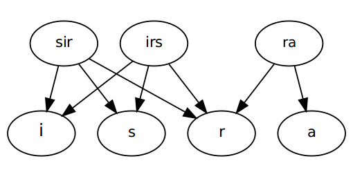
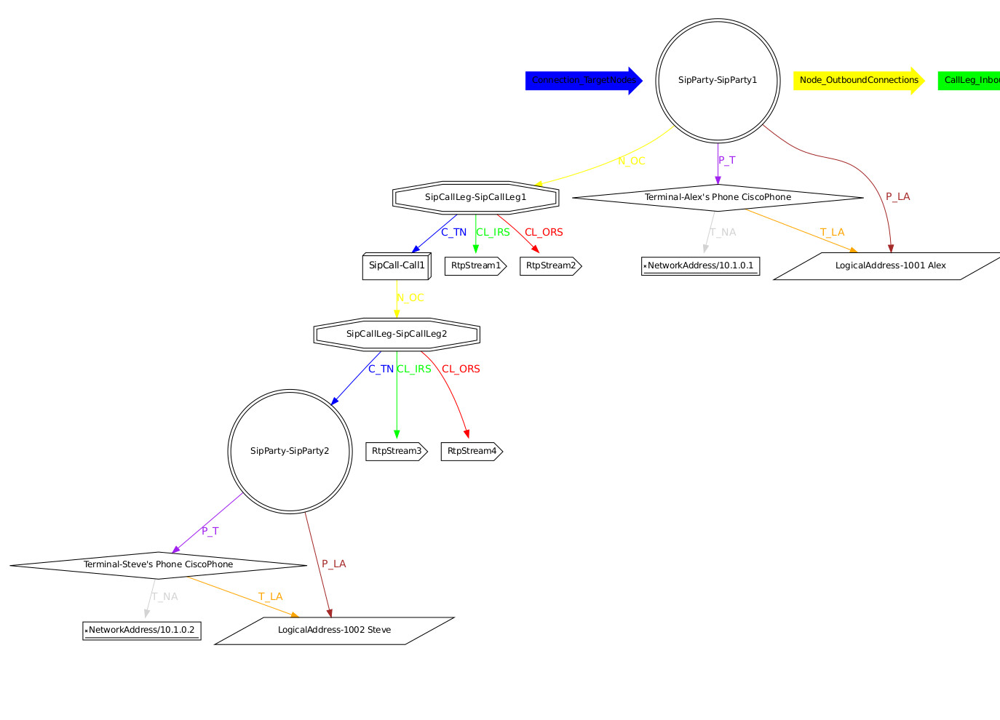
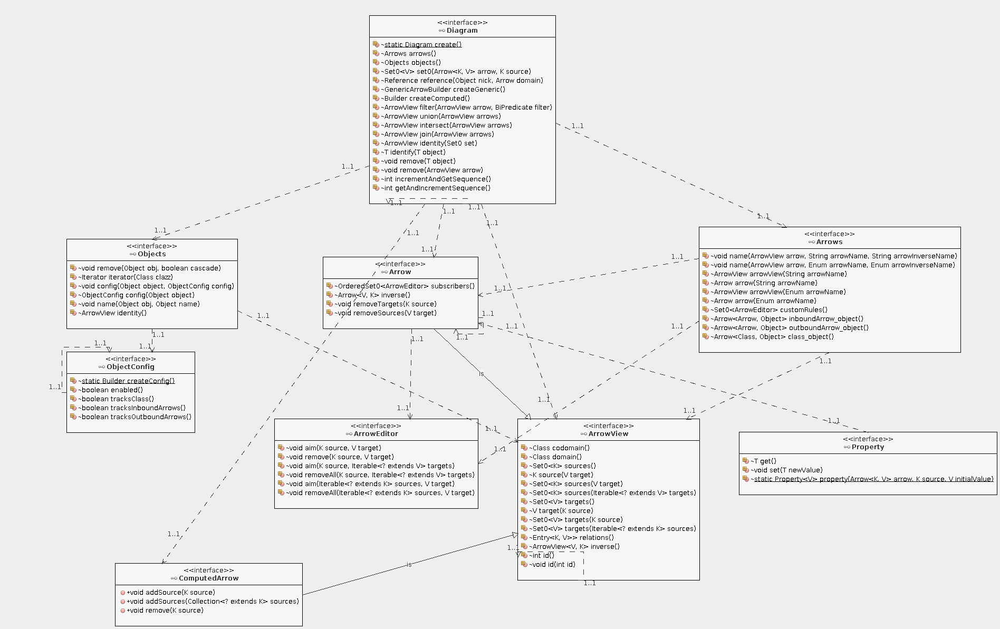

## Arrow Data Library
### an in-memory data querying and manipulation Java library using the Arrow Data Model 

### Introduction 

The [Arrow Data Model](http://www.raisoftware.ro/docs/ArrowDataModel.pdf) is a novel data model, which fuses category theory and the relational model to obtain a hybrid model, which cherrypicks the best attributes of both models.

### Use Cases
The ArrowLib is ideal for use in:
*   [Object Repositories](https://blog.fedecarg.com/2009/03/15/domain-driven-design-the-repository/)
*   graph data structures: its manipulation and querying capabilities compares favorably with [JGraphT](http://jgrapht.org) and [Grph](http://www.i3s.unice.fr/~hogie/software/index.php?name=grph). In fact, good luck finding another Java library supporting directed hypergraphs as ArrowLib can.
*   hash-map replacement with a richer data structure

### Features
#### Joins
See `test/Arrows/Impl/JoinArrowTest.java`

#### Filters
See `test/Arrows/Impl/FilterArrowTest.java`

#### Intersections
See `test/Arrows/Impl/IntersectArrowTest.java`

#### Unions
See `test/Arrows/Impl/UnionArrowTest.java`

#### Rules & Listeners
Arrows.customRules() can be used to define decorator rules which are executed after any editing operation, as used in `ArrowsImpl.add()`

Predefined rules include:
* Arrow2ObjectRule: maintains all inbound and outbound arrows, for any registered object
* Class2ObjectRule: classifies all registered object according to class, providing an effortless Object Repository
* ObjectRegistrarRule: automatically registers objects used in Arrows

#### Constraints
Arrows only accept objects matching the:
- class constraint (aka domain)
- count constraint (allowMultipleTargets)
- nullability constraint (nullableSources)
- 
#### Calculated columns
See `test/Arrows/Impl/ComputedArrowTest.java`

#### Graphviz drawings

After running MainTest check the generated Graphviz files (graph/*.dot).
Sample result #1:

Sample result #2, a diagram with multiple graphs:

### Sample Code
Please check:
`test/
src/Arrows/Test/MainTest.java`

### UML Model
Summary UML diagram including just interfaces

